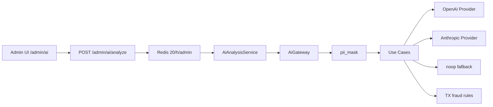

# AI Integration — Kairox Platform v2

Phase 7 modular AI gateway for support assistance, TX fraud analysis, and security audits.

## Architecture



## Package location

`packages/ai-gateway/` — isolated Python package, testable without full API:

```bash
cd packages/ai-gateway
pip install -e ".[dev]"
pytest -v
```

## Use cases

| Use case | Input | Output |
|----------|-------|--------|
| `support_assist` | User message + optional order context | summary, suggested_reply_de, risk_flags |
| `tx_fraud_check` | on_chain amount + claimed amount | verdict, reasons, recommended_action |
| `security_audit` | 24h audit logs + anomalies | Markdown report + findings |

**Important:** AI never sends replies to end users. Admins must manually approve all support responses.

## Configuration

| Variable | Default | Description |
|----------|---------|-------------|
| `OPENAI_API_KEY` | — | OpenAI API key |
| `ANTHROPIC_API_KEY` | — | Anthropic API key |
| `AI_DEFAULT_PROVIDER` | `auto` | `openai`, `anthropic`, or `auto` |
| `AI_REQUEST_TIMEOUT_SEC` | `30` | Provider HTTP timeout |
| `AI_MAX_TOKENS` | `2048` | Max completion tokens |
| `AI_ENABLE_PII_MASK` | `true` | Mask email/phone/wallet before provider call |

## Graceful degradation

When no API keys are configured:

- `noop_provider` returns `{ "summary": "AI unavailable", "confidence": 0 }`
- TX fraud check still uses **rule-based** fast path (30 vs 3000 → `LIKELY_FRAUD`)
- API remains healthy — no crashes

## Rate limits

- `POST /api/v1/admin/ai/analyze`: **20 requests/hour per admin** (Redis)
- Auth: **admin role only** (support cannot use AI mutations)

## Cost estimates (approximate)

| Use case | Tokens (in+out) | Cost @ gpt-4o-mini |
|----------|-----------------|---------------------|
| support_assist | ~800 + 400 | ~$0.0003 |
| tx_fraud_check | ~600 + 200 | ~$0.0002 (rules path: $0) |
| security_audit | ~2000 + 800 | ~$0.0008 |

Actual costs depend on payload size and provider. Monitor via provider dashboards.

## Example TX fraud response

```json
{
  "use_case": "tx_fraud_check",
  "data": {
    "verdict": "LIKELY_FRAUD",
    "reasons": ["on_chain 30 USDT but user claims 3000 USDT"],
    "recommended_action": "REJECT_AND_EDUCATE",
    "confidence": 0.95
  },
  "provider": "rules",
  "model": "tx-fraud-rules",
  "confidence": 0.95
}
```

## Prompt versioning

Prompts live in `packages/ai-gateway/src/ai_gateway/prompts/*.md` — reviewable in PRs, not inline strings.

## Security

- API keys never logged
- PII masked before provider calls (unit-tested)
- Retry: max 3 attempts with exponential backoff, then `ProviderError`

## Install (monorepo)

```bash
pip install -e packages/ai-gateway
pip install -e apps/api[dev]
```
