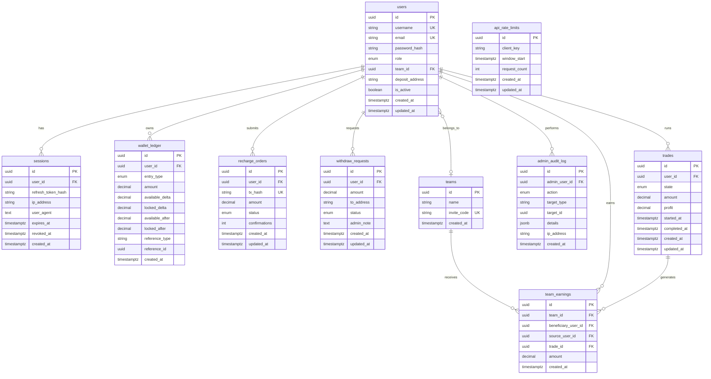

# Database Schema — Kairox Platform v2

Phase 2 introduces an **immutable append-only ledger** as the single source of truth for wallet balances.

## ER Diagram



## Design Principles

| Principle | Implementation |
|-----------|----------------|
| Money precision | `DECIMAL(18,8)` on all monetary columns |
| Ledger immutability | `wallet_ledger` — no UPDATE/DELETE (SQLAlchemy event guards) |
| Balance source of truth | Latest `available_after` / `locked_after` per user |
| Negative balance prevention | `LedgerRepository.apply_balance_delta()` rejects sub-zero |
| DB access | Routes → Services → **Repositories** only |

## Tables

### `users`
Platform accounts. `deposit_address` holds the user's TRC20 deposit target (from platform config or per-user override). `role` is `user`, `admin`, or `support`.

### `sessions`
Refresh-token sessions (hashed). Supports revocation via `revoked_at` and expiry via `expires_at`.

### `wallet_ledger` (IMMUTABLE)
Append-only journal. Each row records:
- `amount` — magnitude of the operation (always ≥ 0)
- `available_delta` / `locked_delta` — signed changes
- `available_after` / `locked_after` — snapshot after apply

**Never** update or delete rows. Corrections = compensating entries.

### `recharge_orders`
On-chain TRC20 recharge submissions. Credited to ledger when confirmations ≥ threshold.

### `withdraw_requests`
User withdrawal requests. Funds locked in ledger on submit; admin approves/rejects.

### `trades`
Trade state machine records. Fund locks/unlocks go through `wallet_ledger`.

### `team_earnings`
Team commission/profit sharing linked to trades and members.

### `admin_audit_log`
Immutable admin action trail (withdraw approvals, role changes, manual adjustments).

### `api_rate_limits`
Optional DB-backed rate limit counters (complements Redis middleware).

## Migrations

| Revision | Name | Description |
|----------|------|-------------|
| `001_initial` | Phase 1 schema | Legacy wallets + ledger_entries |
| `002_phase2_ledger` | Phase 2 ledger | Drops legacy wallet tables; adds immutable ledger + new order tables |
| `003_phase4_recharge` | Phase 4 recharge | Recharge order TTL, expected amount, nullable tx hash |
| `004_phase5_trade` | Phase 5 trade | Pre-start state and trade runtime fields |
| `005_phase6_admin` | Phase 6 admin | VIP fields, withdraw fee/hash, admin idempotency |
| `006_phase8_team` | Phase 8 team | Invite codes and referral links |
| `007_phase8_team_commission` | Phase 8 commission | Adds `team_commission` ledger entry type |
| `008_phase8_trial_bonus` | Phase 8 trial | Adds trial expiry and `registration_bonus` ledger entry type |
| `009_admin_audit_vip_adjust` | Admin audit fix | Adds `vip_level_adjust` audit action |
| `010_withdraw_reconciliation` | Withdraw reconciliation | Adds withdraw `failed`, settlement timestamps, confirmations, and TX uniqueness |

```bash
make migrate   # alembic upgrade head
make seed        # admin + kxtest01 + kxtest02
```

## Seed Data

| Username | Password | Role | Balance |
|----------|----------|------|---------|
| admin | KairoxTest2026 | admin | 0 USDT |
| kxtest01 | KairoxTest2026 | user | 1000 USDT |
| kxtest02 | KairoxTest2026 | user | 500 USDT |
